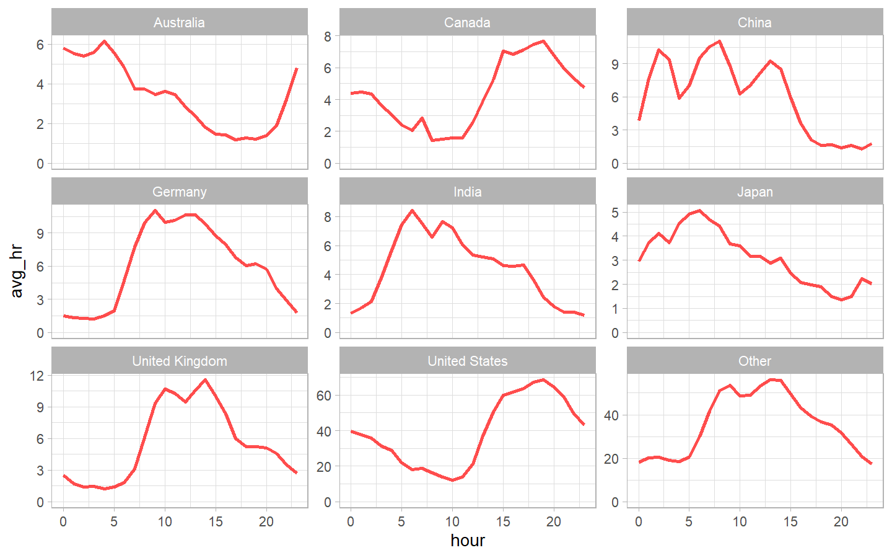

Exploring R Package Downloads from CRAN
================
Gaurav Sharma
29/08/2020

``` r
ttfile <- tidytuesdayR::tt_load("2018-10-30")
```

    ## 
    ##  Downloading file 1 of 2: `r_downloads_year.csv`
    ##  Downloading file 2 of 2: `r-downloads.csv`

``` r
r_downloads_year_raw <- ttfile$r_downloads_year
#r_downloads <- ttfile$`r-downloads`

r_downloads_year <- r_downloads_year_raw %>%
  select(-X1) %>%
  mutate(country = countrycode(country, "iso2c", "country.name"))
```

### Downloads over time

### Daily downloads

``` r
r_downloads_year %>%
    count(date) %>% 
    ggplot(aes(date, n)) +
    geom_line() +
    expand_limits(y = 0) +
    labs(title = "# of R downloads per day")
```

<!-- -->

### Lets have a look at weekly trend

``` r
r_downloads_year %>% 
    count(date) %>% 
    mutate(weekday = wday(date,label = T)) %>% 
    group_by(weekday) %>%
    summarise(Avg = mean(n)) %>% 
    ggplot(aes(weekday, Avg)) +
    geom_line(group = 1, size = 1, color = "blue", alpha = 0.7) +
    expand_limits(y = 0) +
    labs(title = "# of R downloads on weekdays")
```

<!-- -->

### Weekly downloads

``` r
r_downloads_year %>% 
    mutate(week = floor_date(date, "week")) %>% 
    count(week) %>% 
    filter(week > min(week),
           week < max(week)) %>% 
    ggplot(aes(week, n)) +
    geom_line(group = 1, size = 1.5, color = "pink") +
    expand_limits(y = 0) +
    labs(title = "# of R downloads over weeks")
```

<!-- -->

### Downloads per country

``` r
r_downloads_year %>% 
    filter(!is.na(country)) %>% 
    count(country, sort = T) %>% 
    head(16) %>% 
    mutate(n = n/sum(n),
           country = fct_reorder(country,n)) %>% 
    ggplot(aes(country,n)) +
    geom_col() +
    coord_flip() +
    scale_y_continuous(labels = percent_format()) +
    labs(title = "Which countries install R the most",
         subtitle = "Over 47% of the R downloads happen from United States",
         x = "",
         y = "% downloads")
```

<!-- -->

### Lets see how Rs’ different versions downloads has happened over time

``` r
r_downloads_year %>%
    mutate(version = fct_lump(version, 10)) %>% 
    count(date, version) %>% 
    ggplot(aes(date,n, color = version)) +
        geom_line(size =1)
```

<!-- -->

``` r
r_downloads_year %>%
  mutate(version = fct_lump(version, 10)) %>%
  count(date, version) %>%
  ggplot(aes(date, n, color = version)) +
  geom_line(size = 1) +
  facet_wrap( ~ version)
```

<!-- -->

### What time of day are people installing R the most

``` r
r_downloads_year %>% 
  count(hour = hour(time)) %>% 
  ggplot(aes(hour, n)) +
    geom_line(size = 1.5, color = "orange", alpha = 0.6) +
  expand_limits(y = 0)
```

<!-- -->

``` r
r_downloads_year %>% 
  filter(!is.na(country)) %>% 
  mutate(country = fct_lump(country, 8)) %>% 
  count(country,
        hour = hour(time)) %>% 
  ggplot(aes(hour, n)) +
    geom_line(size = 1, color = "violet") +
  expand_limits(y = 0) +
  facet_wrap(~country, scales = "free_y")
```

<!-- -->

``` r
r_downloads_year %>%
  filter(!is.na(country)) %>%
  mutate(country = fct_lump(country, 8)) %>%
  count(country, date, hour = hour(time)) %>%
  group_by(country, hour) %>%
  summarise(avg_hr = mean(n)) %>%
  ggplot(aes(hour, avg_hr)) +
  geom_line(size = 1, color = "red", alpha = 0.7) +
  expand_limits(y = 0) +
  facet_wrap( ~ country, scales = "free_y")
```

<!-- -->

### What operating systems do people use

``` r
r_downloads_year %>% 
  count(os, sort = T) %>% 
  filter(!is.na(os)) %>% 
  mutate(n = n/sum(n),
         os = fct_reorder(os,n)) %>% 
  ggplot(aes(os, n)) +
  geom_col() +
  coord_flip()
```

<!-- -->

``` r
r_downloads_year %>% 
  filter(!is.na(os),
         !is.na(country)) %>% 
  mutate(country = fct_lump(country,8)) %>% 
  count(country, os, week = floor_date(date, "week")) %>% 
  filter(week > min(week)) %>% 
  ggplot(aes(week, n, color = os)) +
  geom_line(size =1) +
  expand_limits(y = 0) +
  facet_wrap(~country, scales = "free_y")
```

<!-- -->

``` r
r_downloads_year %>% 
#  filter(!is.na(country)) %>% 
  mutate(country = fct_lump(country,8)) %>% 
  count(country, week = floor_date(date, "week")) %>% 
  filter(week > min(week)) %>% 
  ggplot(aes(week, n, color = country)) +
  geom_line(size =1) +
  expand_limits(y = 0)
```

<!-- -->

# What is the usual pattern of downloading with respect to time

``` r
r_downloads_year %>% 
  mutate(datetime = as.POSIXlt(date) + time) %>%
  arrange(datetime) %>% 
  group_by(ip_id) %>% 
  mutate(timegap =  as.numeric(datetime - lag(datetime))) %>% 
  filter(!is.na(timegap)) %>% 
  ggplot(aes(timegap)) +
  geom_histogram() +
  scale_x_log10(breaks = c(60^(0:4)),
                labels = c("sec", "minute", "hour", "2.5 Days", "120 Days")) +
  scale_y_continuous(labels = number_format()) +
  geom_vline(xintercept = 86400, lty = 2, color = "red")
```

<!-- -->

### Lets have a look at daily R packages download data

``` r
#r_package_download <- read_csv("http://cran-logs.rstudio.com/2020/2020-08-29.csv.gz", progress = show_progress())
#3r_package_download
```

\#\`\`\`{r} r\_package\_download %\>% filter(country %in% c(“US”, “IN”))
%\>% count(country, package, sort = T) %\>% pivot\_wider(names\_from =
country, values\_from = n) %\>% mutate( total = US + IN, US = US /
total, IN = IN / total, ratio = US / IN ) %\>% filter(\!is.na(total))
%\>% arrange(desc(ratio)) %\>% filter(ratio \< 1)

```` 


### There is a package called cranlogs using which we can downloads daily weekly or stats over a period of time related to cran downlaods


```r
library(cranlogs)
cranlogs::cran_downloads(packages = "R", when = "last-month") %>% 
  mutate(week = floor_date(date, "week"),
         version = fct_lump(version, 4)) %>% 
  count(version, week, count) %>% 
  ggplot(aes(week, count, color = version)) +
  geom_line(aes(group = 1))
````

<!-- -->

``` r
cranlogs::cran_top_downloads(when = "last-week", count = 10)
```

    ##    rank         package  count       from         to
    ## 1     1        magrittr 830472 2020-08-21 2020-08-27
    ## 2     2          aws.s3 673817 2020-08-21 2020-08-27
    ## 3     3 aws.ec2metadata 662503 2020-08-21 2020-08-27
    ## 4     4       rsconnect 650665 2020-08-21 2020-08-27
    ## 5     5        jsonlite 424619 2020-08-21 2020-08-27
    ## 6     6           rlang 367884 2020-08-21 2020-08-27
    ## 7     7              fs 339514 2020-08-21 2020-08-27
    ## 8     8         ggplot2 327557 2020-08-21 2020-08-27
    ## 9     9        devtools 323399 2020-08-21 2020-08-27
    ## 10   10           vctrs 318673 2020-08-21 2020-08-27
